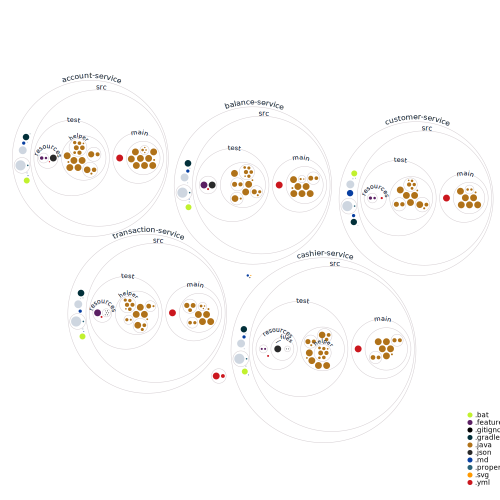

# Introduction

This mono repository is the collection of Microservices to demonstrate a typical bank eco system comprising of:
- [customer-service](./customer-service)
- [account-service](./account-service)
- [cashier-service](./cashier-service)
- [balance-service](./balance-service)
- [transaction-service](./transaction-service)

All the Microservices are written in spring boot.

The codebase can be better visualized as below:

